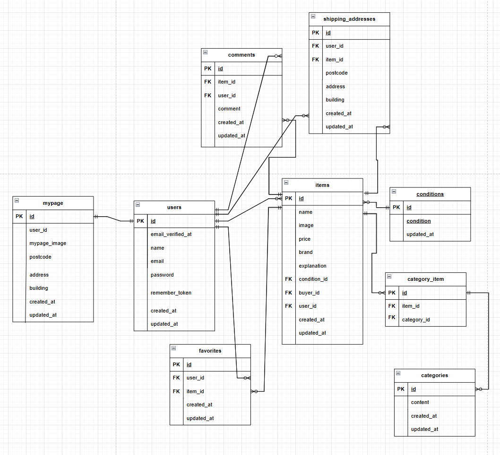

# coachtechフリマ
## 環境構築
### Dockerビルド
1. ```code
    git clone git@github.com:matudairatora/furima.git
    ```
2. ```code
    docker-compose up -d --build
    ```
#### Laravel環境構築
1. ```code
    docker-compose exec php bash
    ```
2. ```code
    composer install
    ```
3. .env.exampleファイルから.envを作成し、環境変数を変更
4. .envに以下の環境変数を追加
    ``` text
    DB_CONNECTION=mysql
    DB_HOST=mysql
    DB_PORT=3306
    DB_DATABASE=laravel_db
    DB_USERNAME=laravel_user
    DB_PASSWORD=laravel_pass

    MAIL_MAILER=smtp
    MAIL_HOST=mailhog
    MAIL_PORT=1025
    MAIL_USERNAME=null
    MAIL_PASSWORD=null
    MAIL_ENCRYPTION=null
    MAIL_FROM_ADDRESS=hello@example.com
    MAIL_FROM_NAME="${APP_NAME}"

    ```
5. ```code
    composer require stripe/stripe-php:17.0.0
    ```
6. ```code
    php artisan key:generate
    ```
7. ```code
    php artisan migrate:fresh
    ```
8. ```code
    php artisan db:seed
    ```
9. ```code
    php artisan storage:link
    ```
10. ```code
    exit
    ```
11. ```code
    brew install mailhog
    ```
12. ```code
    brew services start mailhog
    ```
13. ```code
    sudo chmod -R 777 *
    ```

### 一般ユーザー
1.  ユーザー名:`出品者A`
    email:
    ```code
    user1@example.com
    ```
    password:
    ```code
    user1syuppin
    ```


2.  ユーザー名:`出品者B`
    email:
    ```code
    user2@example.com
    ```
    password:
    ```code
    user2syuppin
    ```

3.  ユーザー名:`購入専用ユーザー`
    email:
    ```code
    user3@example.com
    ```
    password:
    ```code
    user3kounyu
    ```


### PHPunitテスト
1.  ```code
    php artisan config:clear
    ```
-   2~7は、飛ばして、9に行っても大丈夫です。
2.  ```code
    php artisan test tests/Feature/AuthTest.php
    ```
3.  ```code
    php artisan test tests/Feature/ItemTest.php
    ```
4.  ```code
    php artisan test tests/Feature/InteractionTest.php
    ```
5.  ```code
    php artisan test tests/Feature/PurchaseTest.php
    ```
6.  ```code
    php artisan test tests/Feature/ProfileTest.php
    ```
7.  ```code
    php artisan test tests/Feature/EmailVerificationTest.php
    ```
8.  ```code
    php artisan test tests/Feature/ChatTest.php
    ```
9.  ```code
    php artisan test
    ```

### stripe設定
1. .envの中身の一番下にAPIキーを設定します。
2. STRIPE_SECRET_KEY="" # Stripeダッシュボードから取得
3. STRIPE_PUBLIC_KEY=""  # Stripeダッシュボードから取得

- カード情報「4242 4242 4242 4242」月年その他「なんでもOK」

### 使用技術
- PHP 8.0
- Laravel 10.0
- MySQL 8.0
- mailhog v1.0.1
- Fortify
- stripe 17.0

### ER図
- 
### URL
- 開発環境 http://localhost/
- phpMyAdmin http://localhost:8080/
- MailHog http://localhost:8025